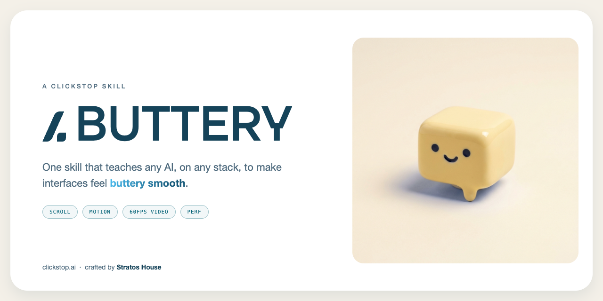

<p align="center">
  
</p>

<h1 align="center">Butter <code>/buttery</code></h1>

<p align="center">
  <b>A set of instructions that teaches any AI, on any stack, to make web interfaces feel buttery smooth.</b><br/>
  Exact easing curves, stagger timing, scroll architecture, 60fps video practice, and reduced-motion design,<br/>
  all extracted from a shipped production site: <a href="https://clickstop.ai">clickstop.ai</a>.
</p>

<p align="center">
  <a href="#install-it">Install</a> ·
  <a href="#whats-inside">What's inside</a> ·
  <a href="SKILL.md">Read the skill</a> ·
  <a href="LICENSE">MIT</a>
</p>

---

## What this is

Every number in this repo shipped on a real website and survived QA on real phones.
When people used the site, the thing they commented on most was how smooth it felt:
the scroll, the way animations fall into place, the 60fps background video. So we
packaged the practices behind that feel into one portable skill.

It is **not** a library, a framework, or a dependency. It is a set of instructions
written against the web platform itself. Plain CSS, Tailwind, React, Vue, Svelte,
vanilla JS: the rules apply everywhere, and any AI coding tool can follow them.

## What it covers

| Area | The short version |
|---|---|
| **Easing vocabulary** | Five named curves, used everywhere, so all motion feels related |
| **Reveal on scroll** | 400ms expo-out, 24px rise, one-shot, fires 80px early, 90ms stagger capped at 360ms |
| **Hero choreography** | Word-by-word entrances, blur-ins, the whole show done in 1.2s |
| **Scroll architecture** | Art-direct desktop scrolling, never touch. Phones keep native physics, always |
| **Micro-interactions** | Card lifts with brand-tinted shadows, morphing buttons, grid-rows accordions, marquees |
| **60fps video** | ffmpeg interpolation to 60fps, poster-first playback, and the rule that a visitor never sees a play button |
| **Performance floor** | Compositor-only properties, zero layout shift, faux-bold-proof fonts, fluid clamp() sizing |
| **Reduced motion** | Five fallback strategies, because accessibility is a design target, not a kill switch |

## Install it

**Claude Code (as a skill)**

```bash
git clone https://github.com/ClickStopAI/buttery.git ~/.claude/skills/buttery
```

Then ask for `/buttery`, or just ask Claude to make something feel smooth; the skill
triggers itself.

**Cursor, Windsurf, Copilot, Codex, or any other agent**

Drop [SKILL.md](SKILL.md) (and the `references/` folder for depth) into your rules
directory (`.cursor/rules/`, `AGENTS.md`, system prompt, wherever your tool reads
instructions), or paste the parts you need into the conversation.

**Humans**

Read [SKILL.md](SKILL.md) top to bottom. It is short on purpose. The five files in
[references/](references/) hold the full recipes with code.

## What's inside

```
buttery/
├── SKILL.md                     The doctrine. Every number, one page.
├── references/
│   ├── motion.md                Reveals, staggers, hero choreography, buttons, accordions
│   ├── scroll.md                The two-mode shell, Lenis rules, anchor scrolling
│   ├── video.md                 60fps pipeline, poster-first playback, the autoplay-refusal test
│   ├── performance.md           Compositor rules, fonts, zero-CLS, the QA gate
│   └── reduced-motion.md        Five fallback strategies with code
└── assets/                      The butter. He is very smooth.
```

## The cheat sheet

```
EXPO_OUT      cubic-bezier(0.16, 1, 0.3, 1)      reveals, entrances, swaps
QUINT_OUT     cubic-bezier(0.23, 1, 0.32, 1)     morphs, accordions, dots
BACK_OUT      cubic-bezier(0.34, 1.56, 0.64, 1)  arrows, pops (overshoot)
EXPO_SOFT     cubic-bezier(0.19, 1, 0.22, 1)     fills, sweeps
MATERIAL      cubic-bezier(0.4, 0, 0.2, 1)       chrome hide/show

Reveal        400ms | y 24px -> 0 | one-shot | IO rootMargin -80px
Stagger       90ms/item, cap 360ms
Hero words    600ms | 80ms apart | accent word one beat later
Card hover    translateY(-3px) | brand-ink shadow at 10%, never black
Video         60fps h264 | poster-first | 6s grace | no play button, ever
Scroll        native on touch, always | smooth-wheel on desktop only
```

## Who made this

**Butter** is a [ClickStop](https://clickstop.ai) skill, crafted by
[Stratos House](https://github.com/StratosHouse). ClickStop builds AI solutions and
always-on agent teams for businesses; this repo is the first in a set of open skills
we are packaging from the practices behind our own products.

MIT licensed. Use it, ship it, make smooth things.
